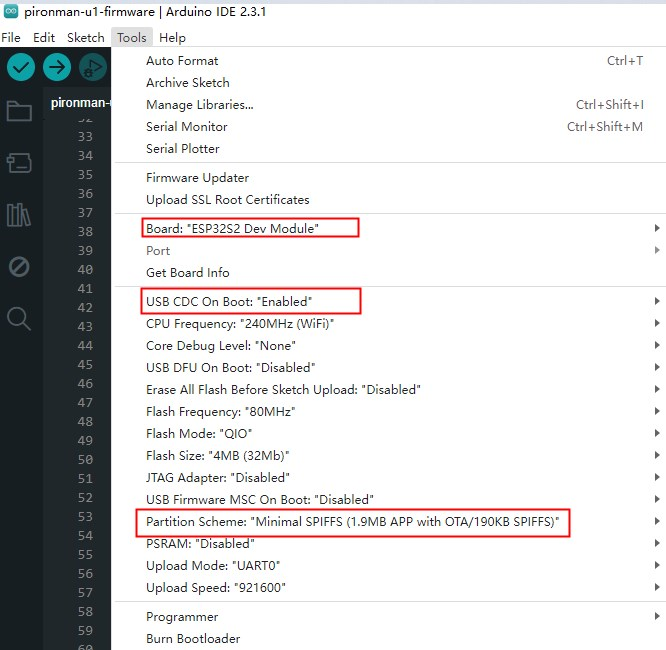

# pironman-u1-firmware (esp32-s2)

Firmware for Pironman U1

## Compile

- Board:
  - esp32 >= 2.0.15
- Libraries:
  - ArduinoJson
  - ESPAsyncWebSrv (or ESPAsyncWebServer <https://github.com/me-no-dev/ESPAsyncWebServer>)

- programming options

## Link

- Docs : <https://docs.sunfounder.com/en/latest/>
- pironman-u1 (python code for pi) : <https://github.com/sunfounder/pironman-u1>
